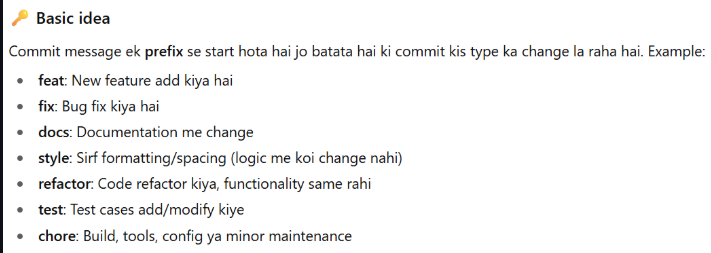

<!-- 

import { UserModel } from "../models/userModel";
import bcrypt from 'bcrypt';
import jwt from "jsonwebtoken";
import { z } from 'zod';
import type { Request, Response } from 'express';
import { HttpStatusCode, ResponseMessage } from '../types/enums'
import { env } from "../config/env"
import type { ObjectId } from "mongoose";

const requireBody = z.object({
    name: z.string().min(3).max(100),
    email: z.string().min(3).max(100).email(),
    password: z.string().min(3).max(30),
})

// Create Access Token (15 minutes)
const createAccessToken = (userId: string | ObjectId) => {
    return jwt.sign(
        { userId, type: 'access' }, 
        env.JWT_SECRET, 
        { expiresIn: env.JWT_ACCESS_EXPIRES_IN } // 15m
    )
}

// Create Refresh Token (7 days)
const createRefreshToken = (userId: string | ObjectId) => {
    return jwt.sign(
        { userId, type: 'refresh' }, 
        env.JWT_SECRET, 
        { expiresIn: env.JWT_REFRESH_EXPIRES_IN } // 7d
    )
}

// Register User
const registerUser = async (req: Request, res: Response) => {
    try {
        const parseData = requireBody.safeParse(req.body);

        if (!parseData.success) {
            return res.status(400).json({
                success: false,
                message: "Validation failed",
                errors: parseData.error.errors
            })
        }

        const emailAlreadyExists = await UserModel.findOne({ email: parseData.data.email })
        if (emailAlreadyExists) {
            return res.status(HttpStatusCode.CONFLICT).json({
                success: false,
                message: "User already exists"
            })
        }

        const hashPass = await bcrypt.hash(parseData.data.password, 10)

        const user = await UserModel.create({
            username: parseData.data.name, // Use 'username' as per your model
            email: parseData.data.email,
            password: hashPass
        });

        // Generate both tokens
        const accessToken = createAccessToken(user._id);
        const refreshToken = createRefreshToken(user._id);

        // Store refresh token in database
        user.refreshToken = refreshToken;
        await user.save();

        return res.status(HttpStatusCode.CREATED).json({
            success: true,
            message: "User registered successfully",
            accessToken,
            refreshToken,
            user: {
                id: user._id,
                username: user.username,
                email: user.email
            }
        });

    } catch (error) {
        console.error('Registration error:', error);
        return res.status(HttpStatusCode.INTERNAL_SERVER_ERROR).json({
            success: false,
            message: "Registration failed"
        });
    }
}

// Login User
const loginUser = async (req: Request, res: Response) => {
    try {
        const { email, password } = req.body

        const user = await UserModel.findOne({ email })
        if (!user) {
            return res.status(404).json({
                success: false,
                message: "User does not exist"
            })
        }

        const isPasswordValid = await bcrypt.compare(password, user.password)
        if (!isPasswordValid) {
            return res.status(403).json({
                success: false,
                message: "Invalid credentials"
            });
        }

        // Generate both tokens
        const accessToken = createAccessToken(user._id);
        const refreshToken = createRefreshToken(user._id);

        // Store refresh token in database
        user.refreshToken = refreshToken;
        await user.save();

        res.status(200).json({
            success: true,
            message: "Login successful",
            accessToken,
            refreshToken,
            user: {
                id: user._id,
                username: user.username,
                email: user.email
            }
        });

    } catch (error: unknown) {
        const errorMessage = error instanceof Error ? error.message : 'An unknown error occurred';
        res.status(HttpStatusCode.INTERNAL_SERVER_ERROR).json({
            success: false,
            message: "Login failed",
            error: errorMessage
        });
    }
}

// Refresh Access Token
const refreshAccessToken = async (req: Request, res: Response) => {
    try {
        const { refreshToken } = req.body;

        if (!refreshToken) {
            return res.status(401).json({
                success: false,
                message: "Refresh token required"
            });
        }

        // Verify refresh token
        const decoded = jwt.verify(refreshToken, env.JWT_SECRET) as any;
        
        if (decoded.type !== 'refresh') {
            return res.status(401).json({
                success: false,
                message: "Invalid token type"
            });
        }

        // Find user and verify refresh token
        const user = await UserModel.findById(decoded.userId);
        if (!user || user.refreshToken !== refreshToken) {
            return res.status(401).json({
                success: false,
                message: "Invalid refresh token"
            });
        }

        // Generate new access token
        const newAccessToken = createAccessToken(user._id);

        res.status(200).json({
            success: true,
            accessToken: newAccessToken
        });

    } catch (error) {
        console.error('Refresh token error:', error);
        return res.status(401).json({
            success: false,
            message: "Invalid or expired refresh token"
        });
    }
}

// Logout (invalidate refresh token)
const logoutUser = async (req: Request, res: Response) => {
    try {
        const { refreshToken } = req.body;
        
        if (refreshToken) {
            const decoded = jwt.verify(refreshToken, env.JWT_SECRET) as any;
            const user = await UserModel.findById(decoded.userId);
            
            if (user) {
                user.refreshToken = undefined; // Remove refresh token
                await user.save();
            }
        }

        res.status(200).json({
            success: true,
            message: "Logged out successfully"
        });

    } catch (error) {
        res.status(200).json({
            success: true,
            message: "Logged out successfully"
        });
    }
}

export { loginUser, registerUser, refreshAccessToken, logoutUser }

// Add to your userSchema
refreshToken: { type: String }

// src/middleware/auth.ts
import jwt from 'jsonwebtoken';
import { env } from '../config/env';
import type { Request, Response, NextFunction } from 'express';

interface AuthRequest extends Request {
    userId?: string;
}

export const authMiddleware = (req: AuthRequest, res: Response, next: NextFunction) => {
    try {
        const token = req.header('Authorization')?.replace('Bearer ', '');

        if (!token) {
            return res.status(401).json({
                success: false,
                message: "Access token required"
            });
        }

        const decoded = jwt.verify(token, env.JWT_SECRET) as any;
        
        if (decoded.type !== 'access') {
            return res.status(401).json({
                success: false,
                message: "Invalid token type"
            });
        }

        req.userId = decoded.userId;
        next();

    } catch (error) {
        return res.status(401).json({
            success: false,
            message: "Invalid or expired access token"
        });
    }
}

// src/routes/userRouter.ts
import express from 'express';
import { registerUser, loginUser, refreshAccessToken, logoutUser } from '../controllers/userController';

const userRouter = express.Router();

userRouter.post('/register', registerUser);
userRouter.post('/login', loginUser);
userRouter.post('/refresh', refreshAccessToken);
userRouter.post('/logout', logoutUser);

export default userRouter;

// Store tokens
localStorage.setItem('accessToken', response.data.accessToken);
localStorage.setItem('refreshToken', response.data.refreshToken);

// API calls with access token
const apiCall = async () => {
    try {
        const response = await fetch('/api/protected', {
            headers: {
                'Authorization': `Bearer ${localStorage.getItem('accessToken')}`
            }
        });
        
        if (response.status === 401) {
            // Access token expired, refresh it
            await refreshToken();
            // Retry the request
        }
    } catch (error) {
        console.error(error);
    }
}

// Refresh token function
const refreshToken = async () => {
    const refresh = localStorage.getItem('refreshToken');
    const response = await fetch('/api/v1/user/refresh', {
        method: 'POST',
        headers: { 'Content-Type': 'application/json' },
        body: JSON.stringify({ refreshToken: refresh })
    });
    
    const data = await response.json();
    localStorage.setItem('accessToken', data.accessToken);
} -->

http://localhost:3000/api/v1/content/add
